# 🚚 Smart Route Optimization System for Last-Mile Delivery

A production-ready full-stack logistics platform that optimizes last-mile delivery routes using real road-network routing, vehicle capacity constraints, fuel estimation, and interactive fleet management dashboards.

The system enables logistics companies to efficiently manage deliveries, assign drivers, optimize routes, monitor fleets in real time, and analyze delivery performance through a modern web application.

---

# 🌐 Live Demo

### Frontend
https://route-optimizer-two-omega.vercel.app/

### Backend API
https://route-optimizer-backend-vw2n.onrender.com/

### Health Check
https://route-optimizer-backend-vw2n.onrender.com/health

---

# 📸 Application Preview


## Login

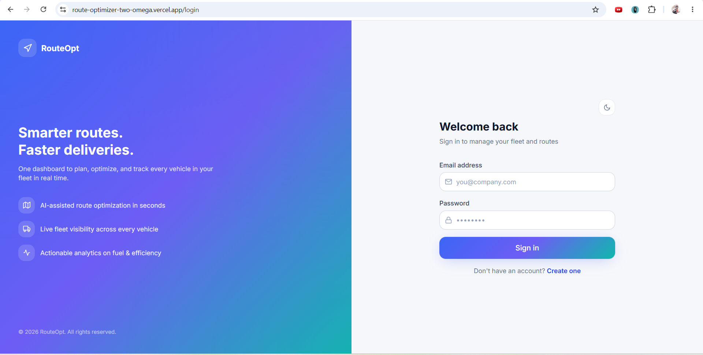

## Dashboard

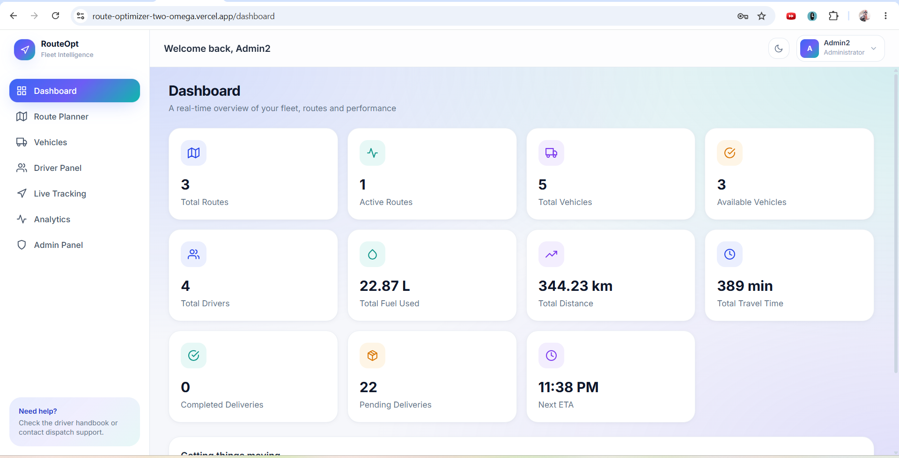

## Route Planner

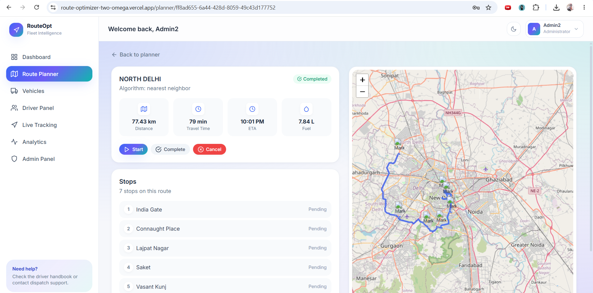

## Vehicle Management

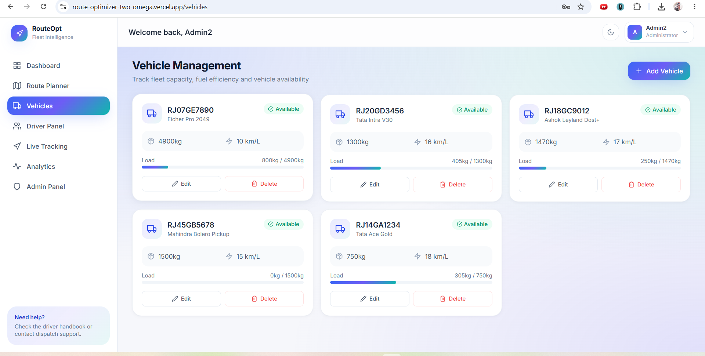

## Driver Panel

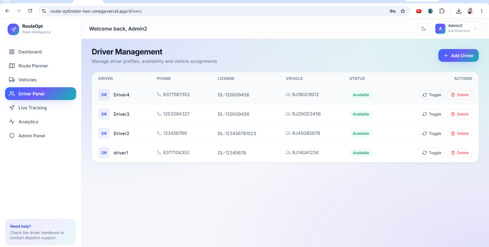

## Analytics Dashboard

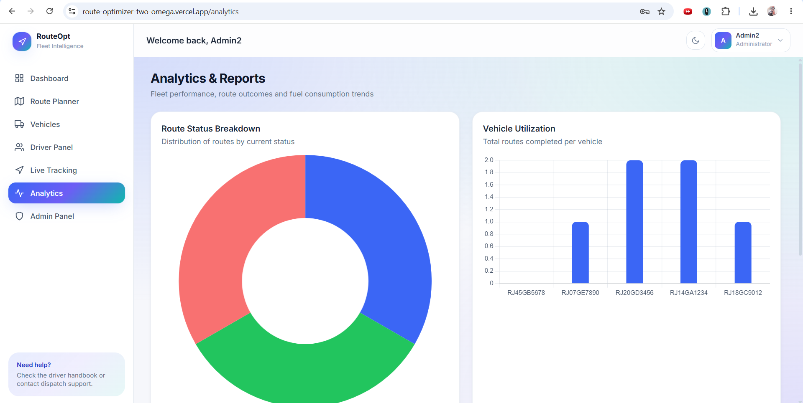

---

# ✨ Features

- Secure JWT Authentication
- Role-Based Access Control (Admin, Dispatcher, Driver)
- Multi-stop Route Optimization
- Real Road Routing using OSRM
- Vehicle Capacity Validation
- Driver Assignment
- Fleet Management Dashboard
- CSV Delivery Upload
- Fuel Consumption Estimation
- ETA Prediction
- Delivery Analytics
- Live Route Tracking
- Responsive UI
- Dark / Light Theme
- Dockerized Deployment
- REST API Architecture

---

# 🏗 System Architecture

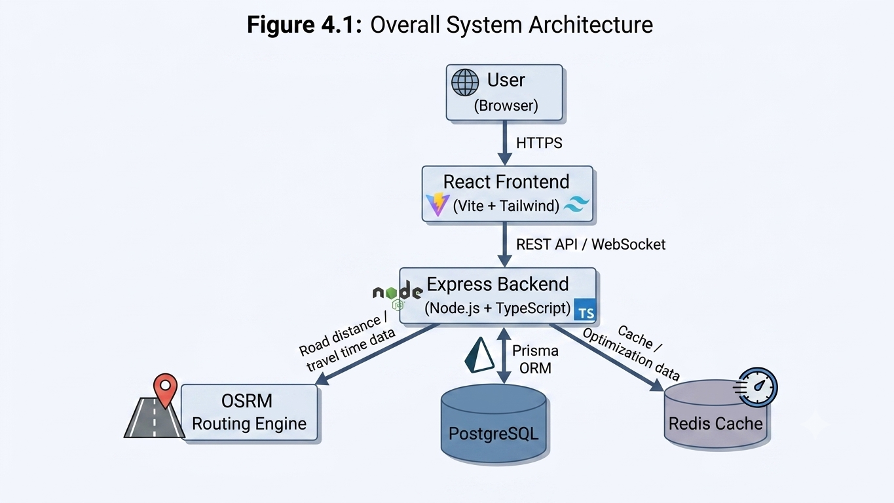

---

# 🛠 Technology Stack

## Frontend

- React.js
- TypeScript
- Vite
- Tailwind CSS
- React Router
- React Query
- React Hook Form
- Axios
- Leaflet
- Chart.js
- Socket.IO Client
- React Icons

---

## Backend

- Node.js
- Express.js
- TypeScript
- Prisma ORM
- PostgreSQL
- Redis
- JWT Authentication
- Bcrypt
- Multer
- Socket.IO

---

## Routing Engine

- Open Source Routing Machine (OSRM)

No Google Maps API is used for route computation.

---

# 🚛 Route Optimization

The application performs road-based route optimization using a self-hosted OSRM server.

The backend communicates with OSRM through:

- `/table` endpoint for road distance matrix generation
- `/route` endpoint for optimized road geometry and travel information

The optimized route includes

- Road distance
- Travel duration
- ETA
- Turn-by-turn road geometry

If OSRM becomes unavailable, the backend automatically falls back to Haversine distance calculations, ensuring uninterrupted route generation.

---

# 📦 Vehicle Capacity Management

Each vehicle maintains

- Maximum Weight
- Maximum Volume
- Current Load
- Remaining Capacity

Before route generation, the backend validates whether the total package weight exceeds the available vehicle capacity.

If capacity is exceeded, the request is rejected with an HTTP 422 response.

Current load is automatically updated after route creation and released when deliveries are completed.

---

# 🧠 Route Optimization Algorithms

The system implements multiple algorithms including

- Nearest Neighbor
- Priority-First Routing
- Dijkstra Algorithm
- A* Search Algorithm
- ETA Calculation
- Fuel Estimation
- Vehicle Capacity Validation

---

# 📂 Project Structure

```
route-optimizer/

├── frontend/
├── backend/
├── testing/
│   ├── load-test.js
│   ├── stress-test.js
│   ├── result_1.png
│   ├── result_2.png
│   ├── result_3.png
│   ├── result_4.png
│   └── result_5.png
│
├── docker-compose.yml
├── README.md
└── .gitignore
```

---

# 🚀 Docker Deployment

## Start Complete Application

```bash
docker compose up -d --build
```

This starts

- PostgreSQL
- Redis
- OSRM
- Backend Server
- Frontend Server

---

# 💻 Local Development

## Backend

```bash
cd backend

npm install

npx prisma generate

npx prisma migrate dev --name init

npm run dev
```

Backend runs at

```
http://localhost:5000
```

Health Endpoint

```
GET /health
```

---

## Frontend

```bash
cd frontend

npm install

npm run dev
```

Frontend runs at

```
http://localhost:5173
```

---

# 📋 How to Use

1. Register an Admin account
2. Login into the Dashboard
3. Add Vehicles
4. Register Driver accounts
5. Assign Drivers to Vehicles
6. Upload delivery CSV
7. Generate Optimized Route
8. Monitor Route Progress
9. View Analytics Dashboard

---

# 📊 Performance Testing

The backend was tested using **Grafana k6**.

## Load Testing

- 20 Virtual Users
- 50 Virtual Users
- 100 Virtual Users
- 200 Virtual Users

## Stress Testing

- Up to 1000 Concurrent Virtual Users

Performance remained stable under increasing load while maintaining successful responses.

---

## Testing Results

### Load Test (20 Users)


---

### Load Test (50 Users)

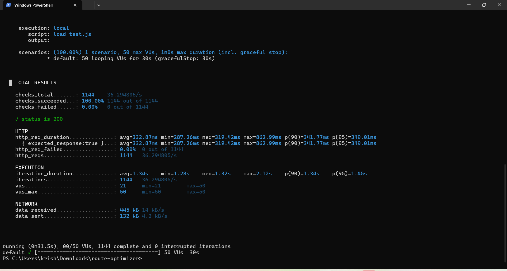

---

### Load Test (100 Users)

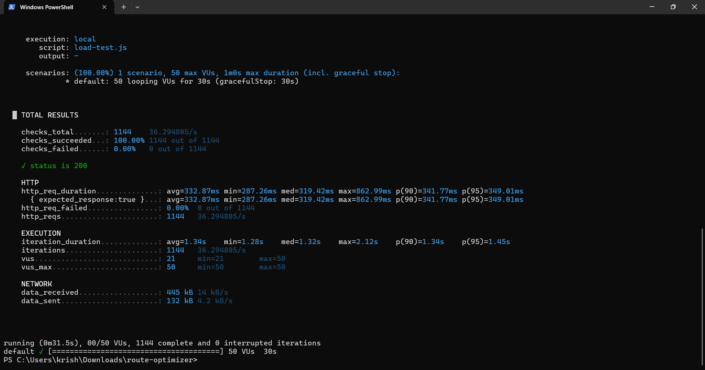

---

### Load Test (200 Users)

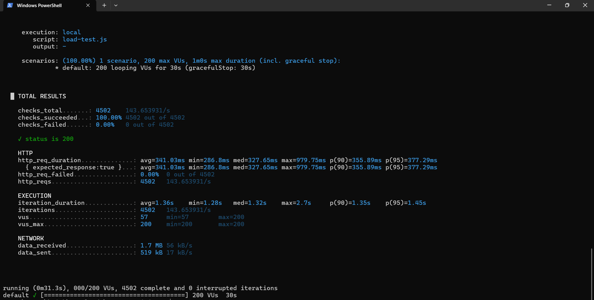

---

### Stress Test (1000 Users)

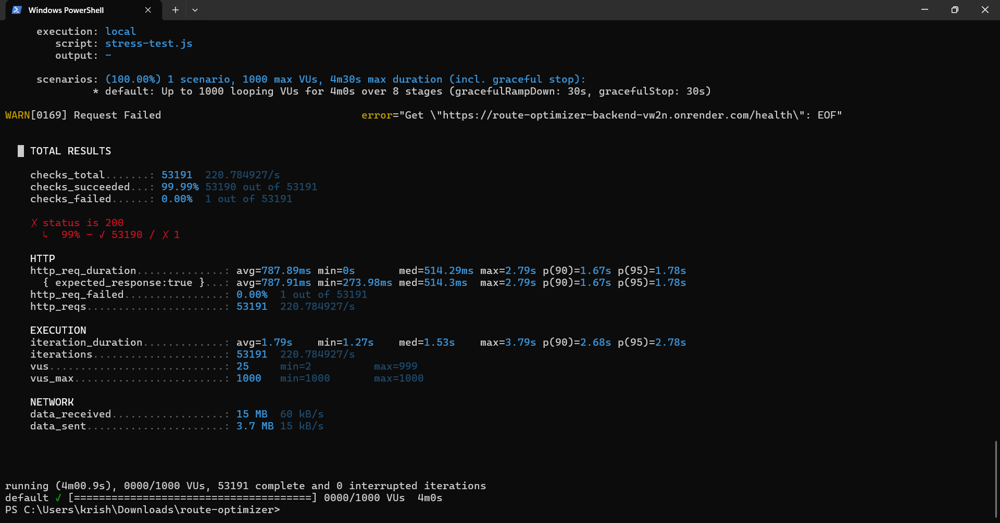

---

# 🔒 Security

Implemented

- JWT Authentication
- Password Hashing using Bcrypt
- Role-Based Authorization
- Protected API Routes
- Input Validation
- HTTP Status Code Handling

Security testing included

- Invalid Login Attempts
- SQL Injection Attempts
- Invalid Payload Validation
- Authentication Verification

---

# 📈 Future Improvements

- AI-Based Route Optimization
- Live Traffic Prediction
- Carbon Emission Dashboard
- Electric Vehicle Optimization
- Predictive Delivery Analytics
- Demand Forecasting
- Mobile Application

---

# 👨‍💻 Author

**Krishan Gopal**

GitHub: https://github.com/KRISHAN2310

---

# 📄 License

This project is developed for educational and internship purposes.